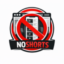

# NoShorts

  

  
  
  
  
  
  
  
  

NoShorts removes YouTube Shorts elements across YouTube, including shelves, tiles, tabs, search filters, and Shorts player pages. Customize what gets removed from the extension popup.

## Table of Contents
- [About](#about)
- [How It Works](#how-it-works)
- [Install](#install)
- [Usage](#usage)
- [Privacy](#privacy)
- [Store Description (Short)](#store-description-short)
- [Store Description (Long)](#store-description-long)
- [Bug Reports](#bug-reports)
- [Contributing](#contributing)
- [Build](#build)
- [Makefile](#makefile)
- [Notes](#notes)

## About
NoShorts is a lightweight, configurable browser extension that hides YouTube Shorts so you can focus on regular videos. It works on the YouTube homepage, search results, channels, and Shorts player pages.

## Privacy
NoShorts does not collect, store, or transmit any personal data. All settings are stored locally in your browser.

## Store Description (Short)
Hide YouTube Shorts across YouTube. Remove Shorts shelves, tiles, tabs, search filters, and Shorts player pages. Fully configurable with simple toggles.

## Store Description (Long)
NoShorts is a lightweight extension that removes YouTube Shorts elements so you can focus on regular videos. It deletes Shorts content from:
- Home shelves and carousels
- Shorts tiles and links
- Shorts tabs and sidebar entry
- Search filter chips
- Shorts player pages

Everything is configurable from the extension popup, and changes apply immediately.

## How It Works
The extension injects a content script into `www.youtube.com` and `m.youtube.com`, then removes Shorts-related DOM nodes as pages load. A MutationObserver keeps the page clean as more content appears. You can enable/disable each category from the popup, and changes apply immediately.

## Install
### Chrome Web Store
NoShorts on the Chrome Web Store:

### Firefox Add-ons
NoShorts on Firefox Add-ons(Called Say No To Shorts):

### Manual Install (Releases)
1. Download the latest release from GitHub Releases.
2. Unzip the archive.
3. Follow the local install steps below for your browser.

### Manual Install (Packaged Files)
#### Chrome / Edge (ZIP)
1. Download the Chrome zip from GitHub Releases.
2. Unzip it to a folder.
3. Open `chrome://extensions/`.
4. Enable `Developer mode`.
5. Click `Load unpacked` and select the unzipped folder.

#### Firefox (XPI)
1. Download the Firefox signed `.xpi` from GitHub Releases.
2. Open `about:addons`.
3. Click the gear icon and choose `Install Add-on From File...`.
4. Select the `.xpi` file.

### Local Install (Unpacked)
#### Chrome / Edge (Chromium)
1. Open `chrome://extensions/`.
2. Enable `Developer mode`.
3. Click `Load unpacked` and select this folder.

#### Firefox (Temporary Add-on)
1. Open `about:debugging#/runtime/this-firefox`.
2. Click `Load Temporary Add-on...`.
3. Select `manifest.json` from this folder.

## Usage
1. Click the NoShorts extension icon.
2. Toggle the areas you want to hide.
3. Refresh YouTube tabs if needed.

## Bug Reports
If you find a bug, please open an issue on GitHub and include:
- A clear title and description
- Steps to reproduce
- Expected vs. actual behavior
- Your browser and version
- Screenshots or console errors if available

## Contributing
Contributions are welcome. The fastest way to get a change merged:
- Fork the repo and create a feature branch
- Run `make test` before submitting
- Open a PR with a clear summary and screenshots if UI changes are involved

## Build
## Makefile
- `make install`: install dependencies.
- `make test`: run unit, smoke, and Firefox lint tests with dividers.
- `make test-unit`: run Jest unit tests.
- `make test-smoke`: run Playwright smoke tests (installs Chromium).
- `make test-firefox`: lint the extension with `web-ext`.
- `make firefox-run`: launch Firefox with the extension loaded.
- `make build`: generate a dev versioned zip in `dist/`.
- `make build-release`: build Chrome + Firefox unsigned + Firefox signed packages.
- `make build-release-chrome`: build the Chrome package only.
- `make firefox-unsigned`: build the unsigned Firefox XPI.
- `make firefox-signed`: build the signed Firefox XPI (requires AMO credentials).
- `make playwright-install`: install Playwright Chromium (CI installs deps too).
- `make clean`: remove `dist/`.

## Notes
- If YouTube changes markup, selectors may need updates in `content.js`.
